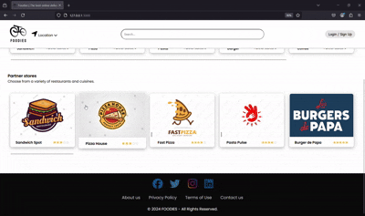

# Foodies

Welcome to Foodies!

This is a full-stack web application designed to simulate the complete process of placing and managing a delivery order. The app allows users to select delivery options via different stores and place an order. Built with a modern tech stack, this project demonstrates the use of various web technologies for both frontend and backend development.

<p align="center"> 
   
</p>

[Watch Demo Video](screenshots/foodies_demo.mp4)

## Installation Instructions

To install the project, follow these steps:

1. **Clone or Download the Project**
   - Clone the repository using the command:
     ```
     git clone https://github.com/orestis-koutroumpas/Foodies
     ```
   - Alternatively, download the ZIP file from the repository and extract it to the desired folder.

2. **Install Dependencies**

    a. **Open a terminal and navigate to the project folder:**

    ```
    cd <project_folder_name>
    ```

    b. **Make sure you have Node.js installed on your computer.** You can check by running the following commands:

    ```
    node -v
    ```

    ```
    npm -v
    ```

    If you haven't installed Node.js, you can do so from the [official Node.js website](https://nodejs.org/).

    c. **Run the following command to install all necessary packages:**

    ```
    npm install
    ```

    This process will install all the necessary dependencies required for your project as defined in the `package.json` file.

3. **Start the Server**
   To start the server, run the following command:
     ```
     npm start
     ```

After these steps, the server will be up and running, and the application will be available for use.

## Application Availability

The application is available on the website [Foodies App](https://foodies-app-58fe3d79abda.herokuapp.com/).

---

**Note:** This application is no longer hosted.
